# Helm-Project
Helm the Helming way... (Notes and Project) :joy:

## CONCEPTS
### Helm is the packgae manager for kubernetes just like apt is to ubuntu/Debian Linux OS
- HELM CHART | Package Used for Deploying, Modifying and Managing Application via Kubernetes cluster 
- HELM REPO | E.g special kind of Repositories where we can have multiple charts e.g bitnami repo has nginx, grafana and lots more..
- HELM RELEASE | An instance of a Helm Chart Application Deployment is a Helm Release

# Setup kubernetes by Installing all pre-requisites.....

## 1) Install AWS CLI v2

```bash
cd ~
curl "https://awscli.amazonaws.com/awscli-exe-linux-x86_64.zip" -o "awscliv2.zip"
sudo apt update && sudo apt install -y unzip
unzip awscliv2.zip
sudo ./aws/install
aws --version

# Configure credentials (Access Key, Secret, region, output)
aws configure
```
---
## 2) Install Terraform (HashiCorp APT repo)

```bash
sudo apt-get update && sudo apt-get install -y gnupg software-properties-common curl

curl -fsSL https://apt.releases.hashicorp.com/gpg | \
  sudo gpg --dearmor -o /usr/share/keyrings/hashicorp-archive-keyring.gpg

echo "deb [signed-by=/usr/share/keyrings/hashicorp-archive-keyring.gpg] https://apt.releases.hashicorp.com $(lsb_release -cs) main" | \
  sudo tee /etc/apt/sources.list.d/hashicorp.list

sudo apt-get update && sudo apt-get install -y terraform
terraform -version
```
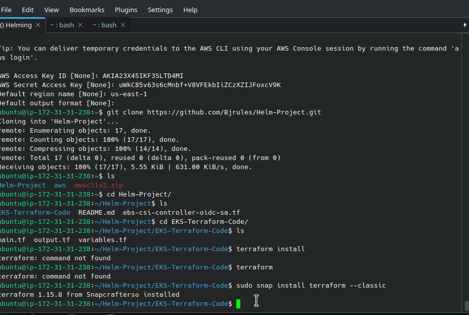
---
## 3) Provision infra with Terraform

From your Terraform project directory (e.g., `~/EKS-1.33-main`):

```bash
terraform init
terraform apply --auto-approve
```

> Ensure variables (if any) are set (via `*.tfvars` or environment variables) before apply.

---

## 4) Install kubectl (latest stable)

```bash
curl -LO "https://dl.k8s.io/release/$(curl -L -s https://dl.k8s.io/release/stable.txt)/bin/linux/amd64/kubectl"
curl -LO "https://dl.k8s.io/release/$(curl -L -s https://dl.k8s.io/release/stable.txt)/bin/linux/amd64/kubectl.sha256"

# Verify checksum (must show: kubectl: OK)
echo "$(cat kubectl.sha256)  kubectl" | sha256sum --check

sudo install -o root -g root -m 0755 kubectl /usr/local/bin/kubectl
kubectl version --client
```

---

## 5) Generate kubeconfig for EKS

```bash
aws eks --region us-east-1 update-kubeconfig --name bj-cluster

# Quick check (may take a minute after cluster creation)
kubectl get nodes
```

---

## 6) Install ekctl
```
curl -LO "https://github.com/weaveworks/eksctl/releases/latest/download/eksctl_Linux_amd64.tar.gz"
tar -xzf eksctl_Linux_amd64.tar.gz
sudo mv eksctl /usr/local/bin
eksctl version
```
---

## 7) Install ekctl
> Associate an IAM OIDC provider with your EKS cluster to enable IAM roles for Kubernetes service accounts:
```
eksctl utils associate-iam-oidc-provider --region us-east-1 --cluster banjo-cluster --approve
```
> This command associates the OIDC provider required for enabling IAM roles for service accounts in the EKS cluster.
---

## 8) Create an IAM Service Account
> Create a Kubernetes service account with IAM permissions for the Amazon EBS CSI Driver:
```
eksctl create iamserviceaccount \
  --region us-east-1 \
  --name ebs-csi-controller-sa \
  --namespace kube-system \
  --cluster banjo-cluster \
  --attach-policy-arn arn:aws:iam::aws:policy/service-role/AmazonEBSCSIDriverPolicy \
  --approve \
  --override-existing-serviceaccounts

```
    - [x] --name ebs-csi-controller-sa: Name of the service account.
    - [x] --namespace kube-system: Namespace where the service account will be created.
    - [x] --attach-policy-arn: IAM policy ARN for EBS CSI Driver permissions.
    - [x] --approve: Automatically approve the creation.

---
## 9) Deploy the AWS EBS CSI Driver
> Deploy the AWS EBS CSI Driver in the cluster using the following command:
```
kubectl apply -k "github.com/kubernetes-sigs/aws-ebs-csi-driver/deploy/kubernetes/overlays/stable/ecr/?ref=release-1.11"

```
> This command deploys the latest stable release of the EBS CSI Driver from the official repository.

---
#Some Commands.


```
kubectl get nodes
kubectl describe sa ebs-csi-controller-sa -n kube-system
kubectl get pods -n kube-system -l app.kubernetes.io/name=aws-ebs-csi-driver
kubectl get pods
```

### Install HELM
```
curl -fsSL https://raw.githubusercontent.com/helm/helm/main/scripts/get-helm-3 | bash

```
---
# Helm Projects
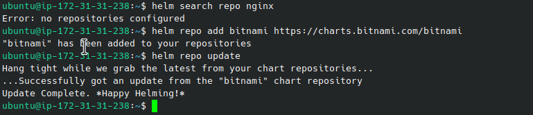
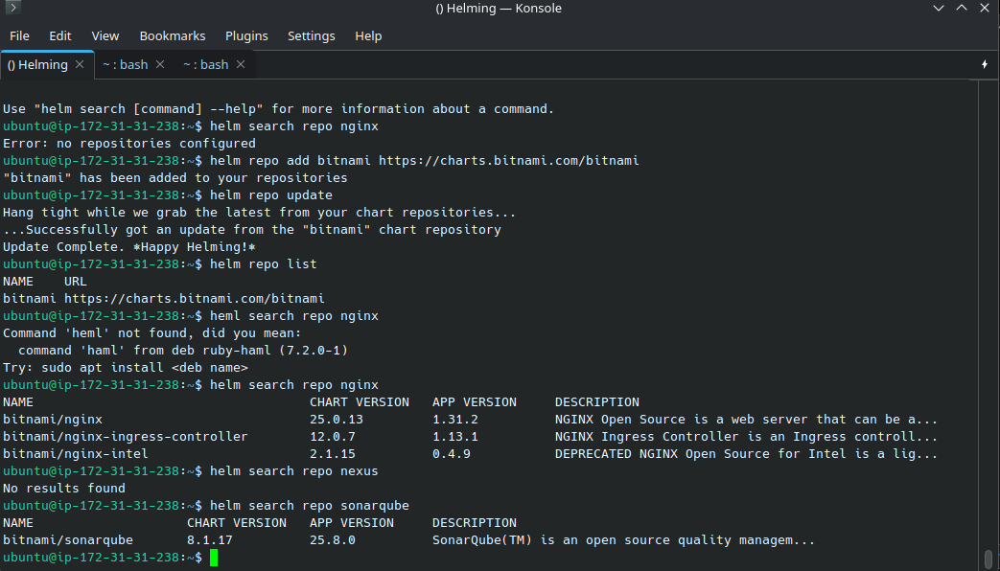
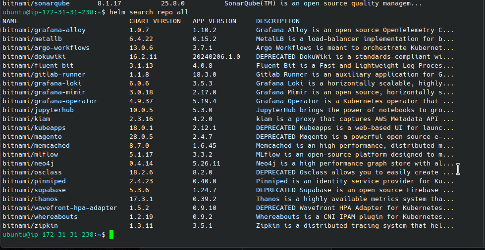

> google artifaccthub.io
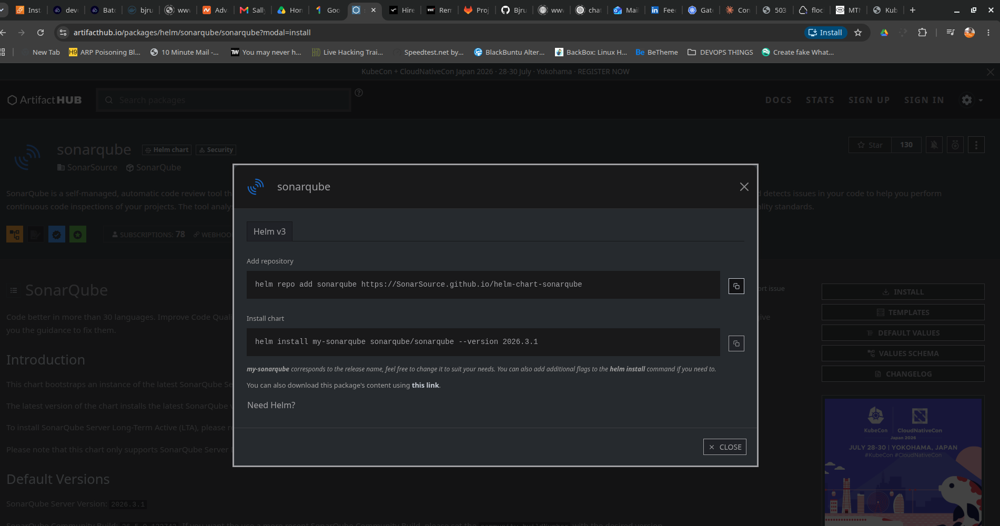
> for better view of helm charts, kindly sudo apt install tree
```
helm create my-nginx
```
> Deleted most files and Directory that is not useful so as to avoid errors (read Screenshots)
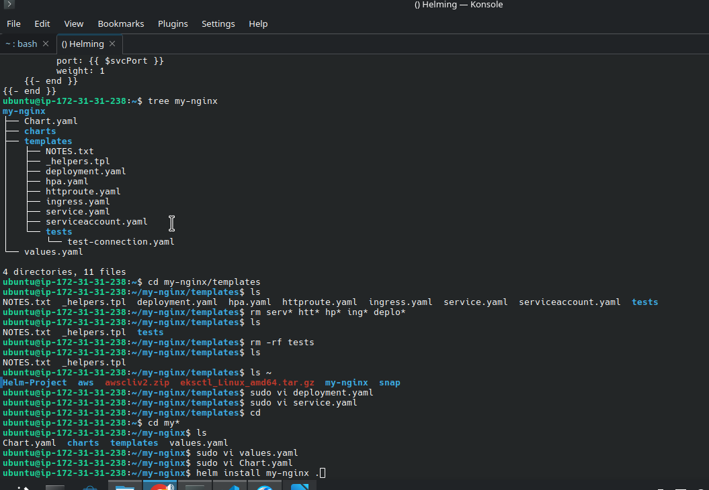
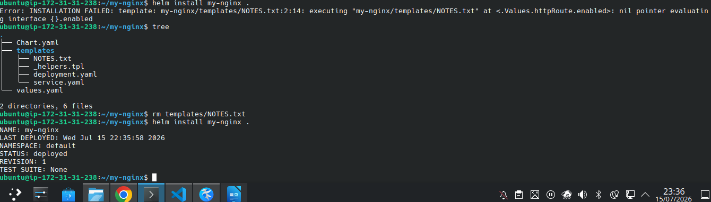
> view on http
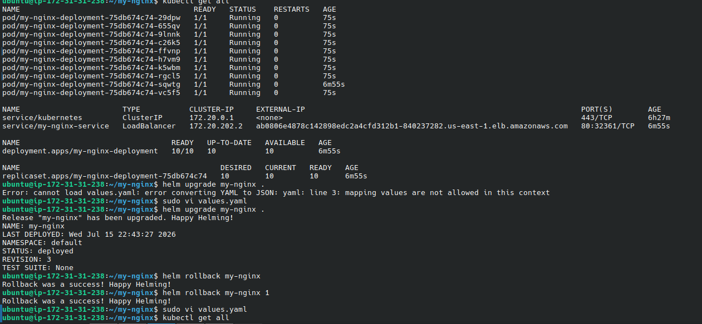

```
# perform this after modifying a value in values.yaml
helm upgrade my-nginx .

#rolling back to a revious verion that worked perfectly
helm rollback my-nginx 1
```
> create values.yaml file for different Environment while namespace may depict different environment (Read Screenshots)
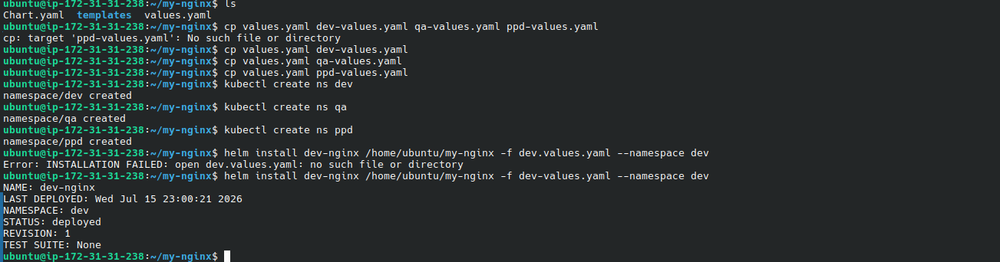

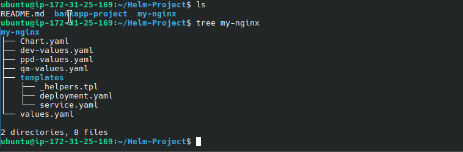

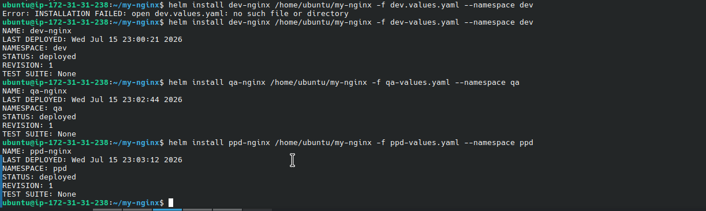

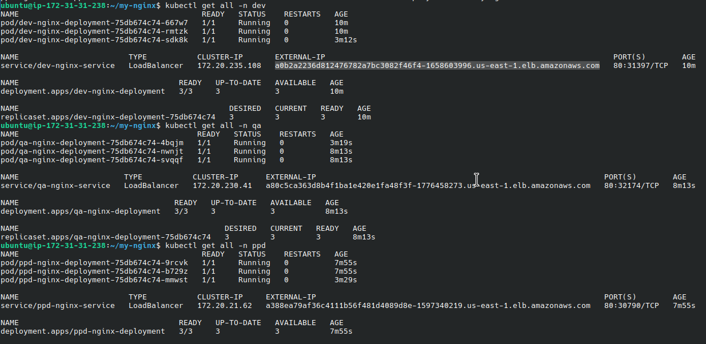
> showing application installed in the various Environments

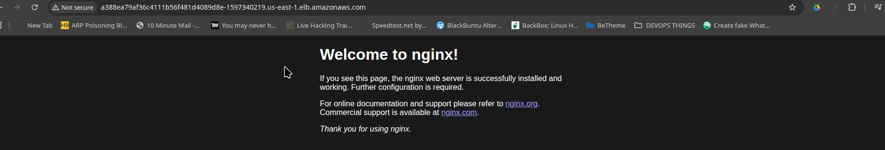


> uninstalling a helm release
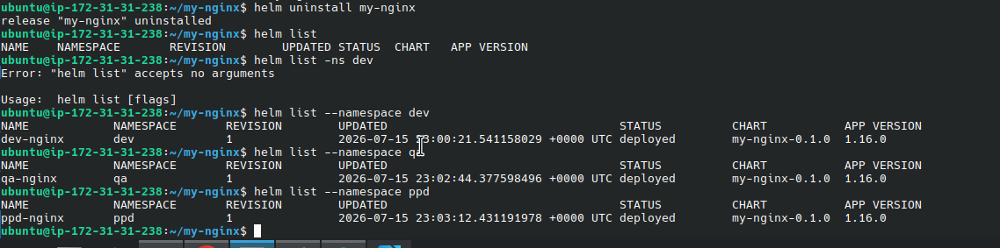

## HELMING BANK APP
```
helm create bankapp-project
```
### Kindly refer to the Directory 'bankapp-project' to see how I tweek the bank app in a helm Chart
 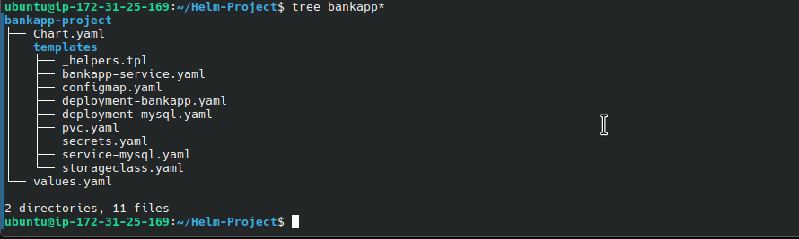
 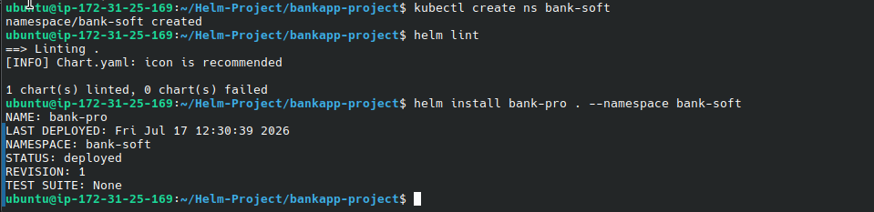
## Many troubleshootings here .

1. kubectl get pv (shows that my service account could not create the volume for my-sql to use, so mysql pods was showing pending and never got created)
2. FailedScheduling: running PreBind plugin "VolumeBinding": binding volumes: context deadline exceeded 
3. CrashLoopBackOff made my bankapp pods never to run at all. I also used a wrong Dockerimage
  
 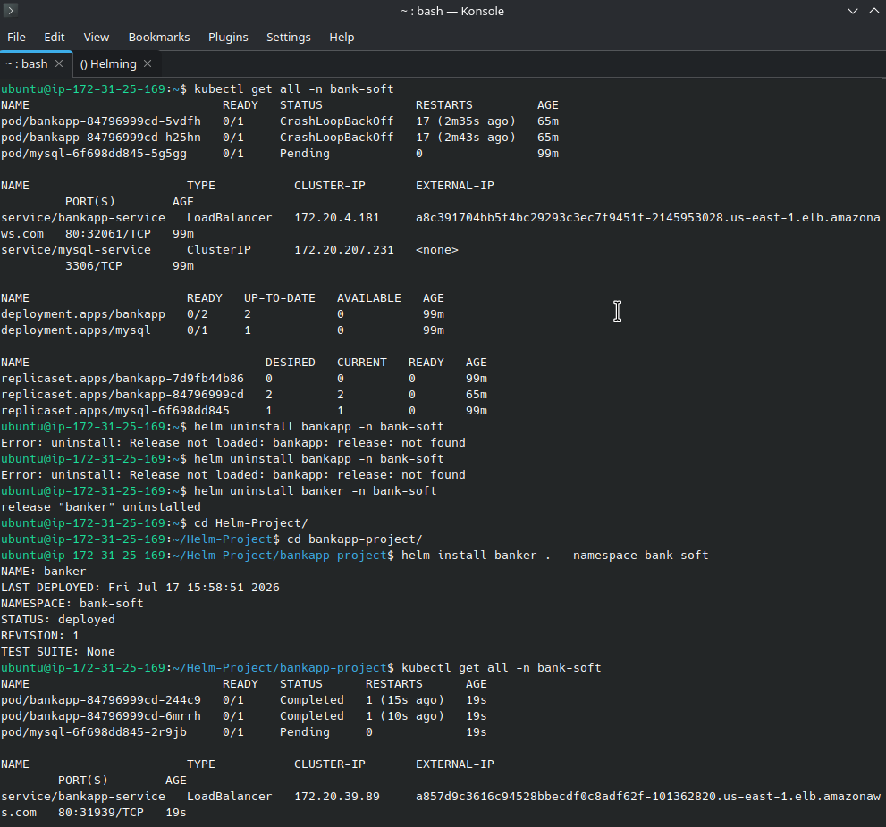
---
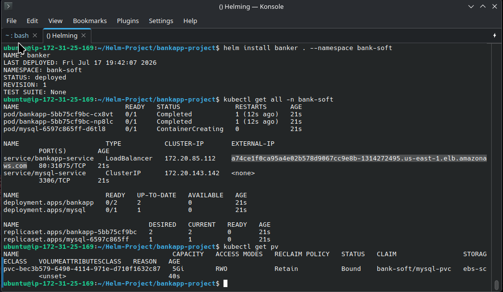
### The fix was to do terraform destroy on the kubernetes EKS module I was using. and used the EKS-1.33-main.
## Yipee :joy: :joy:
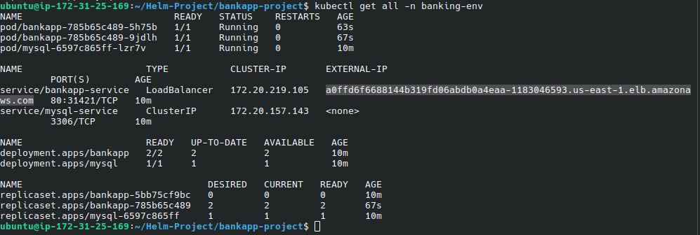

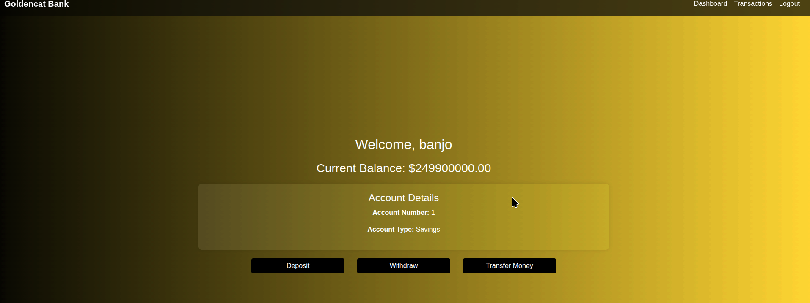
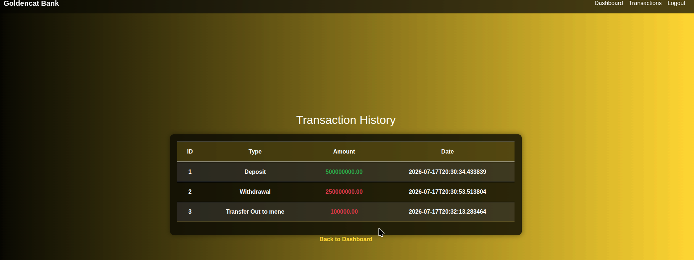

#### Created another Release, Namespace and it all worked. 

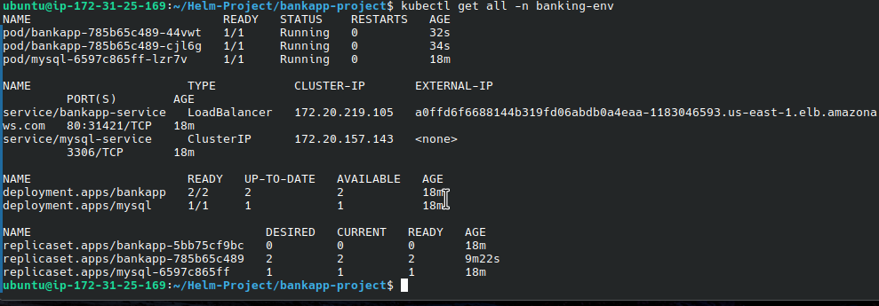
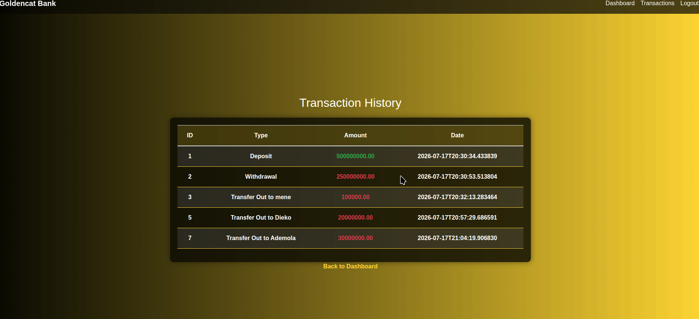

# THANK YOU !

### SOME HELM COMMANDS
```
kubeclt create namespace bank-soft

helm install <Revision-Name> . --namespace <Namespace>

kubectl describe  pvc -n bank-soft

helm uninstall bankapp -n bank-soft
kubectl get pods -n kube-system | grep ebs-csi

```
# THANK YOU !


